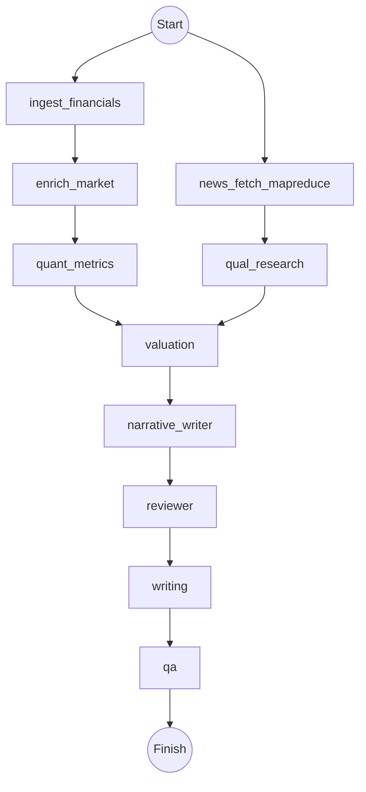

# AGENTS

## 边界与原则
- 仅在本仓库 `/mnt/d/Work/A Stock Agent/CodexEnv` 内工作；可访问互联网查询公开资料。
- 结构化行情/财务数据全部使用 TuShare，严格按照 `TushareAPI/TUSHARE_CONFIG.md` 的 token、`base_url`、代理配置调用；禁止使用其他证券数据源。
- 新闻、舆情、非结构化信息与推理统一走 Poe（Gemini），按场景设置 `web_search` 与 `thinking_budget`（环境变量 `POE_WEB_SEARCH` / `POE_THINKING_BUDGET` 提供默认，调用时可覆盖）。
- 凭证仅可从环境变量或 `.tushare_token` 读取，禁止硬编码与泄露。
- 输出物写回仓库（`reports/`, `run/checkpoints/` 等），遵循既有分层：Domain / Infrastructure / Workflow / Presentation。

## LangGraph Blueprint（v3，分支+复核）
主干分支：数据流与信息流并行，再汇合到估值/写作/复核。
1) ingest_financials (TuShare/SQLite 报表+股东/基础信息 upsert)  
2) enrich_market (TuShare 行情窗口)  
3) news_fetch_mapreduce (Poe+web_search，新闻 Map→Reduce)  
4) quant_metrics (成长/比率/异常检测)  
5) qual_research (行业/同业/催化剂，Poe+web_search)  
6) valuation (DCF/相对估值，锚定现价)  
7) narrative_writer (Poe，无搜索，JSON 结构化段落)  
8) reviewer (Poe 复核：数据一致性/合规，必要时回写重试)  
9) writing (Jinja 渲染，嵌入 charts)  
10) qa (缺失检查、错误汇总)

## 阶段职责与开发要点
| Stage | 目标 | 主要输入 | 产出 | 编程任务 |
|-------|------|---------|------|---------|
| ingest_financials | SQLite 读取并按 TuShare 规范补拉报表/股东/基础信息 | ticker, SQLite, TuShare | `financials`, `holders`, `basic_info` | 标准化字段映射、upsert、缺失补齐 |
| enrich_market | 近 120 天行情窗口，提供当前价与波动 | TuShare daily | `price_history`, `current_price` | 字段对齐、简单统计，预留缓存 |
| quant_metrics | 成长/比率/异常检测 | financials | `growth_curve`, `ratios`, `anomalies` | pandas 计算、除零保护、单测 |
| news_fetch_mapreduce | 联网搜集新闻，Map→Reduce 汇总 | Poe+web_search | `news_items`, `news_digest` | 分条摘要+合并，保留日期/来源/情绪 |
| qual_research | 行业/同业/催化剂定性摘要 | news_digest, basic_info | `qual_notes` | 搜索+总结，引用来源 |
| valuation | DCF + 相对估值，生成估值区间 | financials, ratios, price | `valuation` | DCF/PE/EV 假设暴露给模板 |
| narrative_writer | 结构化正文 JSON | metrics+valuation+news | 各叙事字段 | Poe 无搜索，JSON 验证 |
| reviewer | 复核一致性/合规 | 全部草稿 | `review_report`, 可触发重写 | 失败则回写错误并请求修订 |
| writing | 渲染 Markdown 报告 + 图表 | 所有上游字段 | `markdown_report`, `charts` | 完善 Jinja 模板，锁定量化数据不被修改 |
| qa | 轻量 QA，标记缺失段落 | 全部 state | `qa_report` | 核心检查列表、输出人类可读总结 |

## 操作指令
- 查看流程：`python -m astock_report.app.main plan`
- 生成报告：`python -m astock_report.app.main generate <ticker> --name <公司名> [--json]`
- LLM 调用方式：`GeminiClient.generate(messages, web_search=<bool>, thinking_budget=<int>)`；默认为环境变量值。

## 参考文档
- `README.md`：安装、环境变量、运行方式
- `docs/architecture.md`：分层与依赖规则
- `ProjectPlan.md`：产品与技术方案
- `TushareAPI/README.md` 与 `TushareAPI/TUSHARE_CONFIG.md`：TuShare 调用与配置约束
