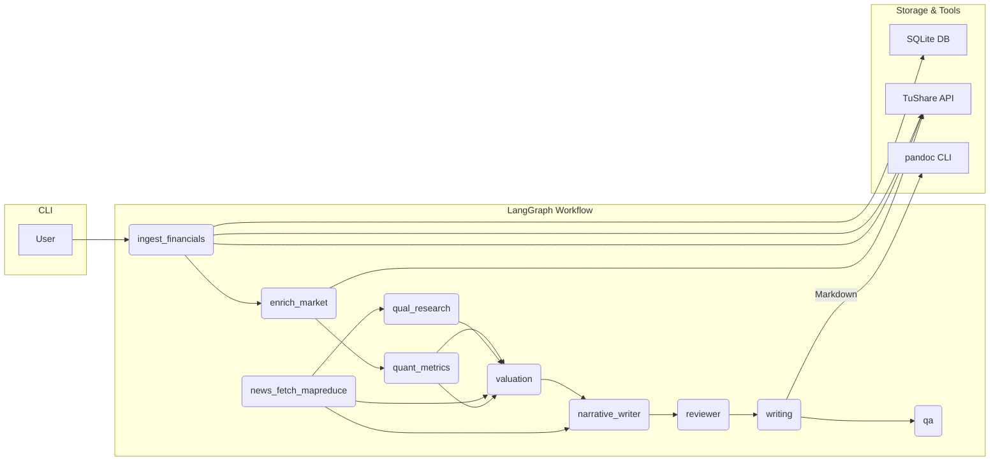
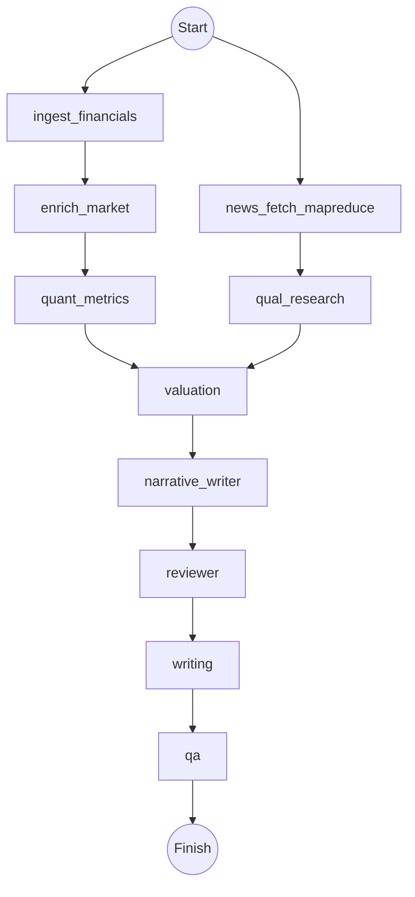
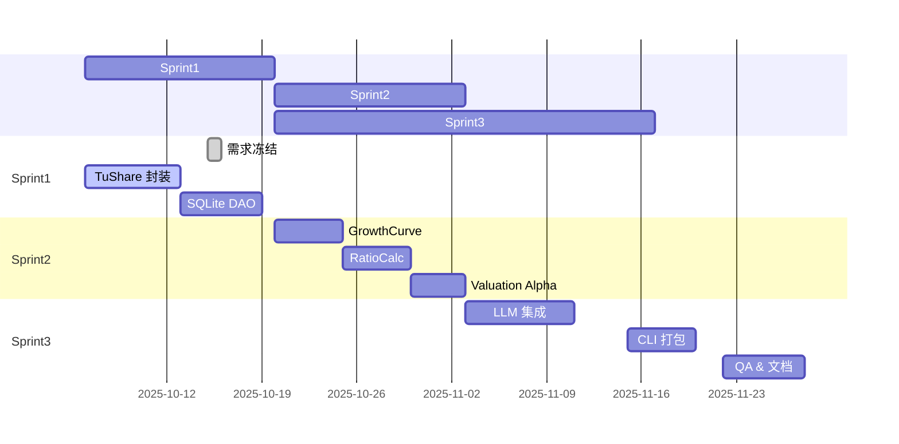

# A 股上市公司深度报告自动生成系统（MVP）项目企划书  
> 版本：v1.0  撰写日期：2025-10-05  
> 提示：如果只需要快速了解项目，请先阅读 `README.md` 与 `Projects.md`；本文件是完整的产品/技术/里程碑详细规划。

---

## 目录
1. 项目概述  
2. 目标与范围  
3. 总体技术架构  
4. 功能模块明细  
5. LangGraph 工作流  
6. 数据层设计  
7. 估值与盈利预测引擎  
8. 大模型集成与 Prompt 方案  
9. 交付物与里程碑计划  
10. 质量保证与测试  
11. 风险与应对  
12. 后续扩展路线  
13. 工作框架（WBS & RACI & Sprint 规划）

---

## 1. 项目概述
- **项目定位**  
  构建一款“个人可部署”的 CLI 工具，自动生成 A 股上市公司的深度研究报告（Markdown／PDF），覆盖财务拆解、估值、风险等七大章节，帮助独立研究员与中小机构显著降低资料整理与撰写成本。  
- **核心卖点**  
  1. “一键”产出机构级深度报告  
  2. 完整可解释的代码与数据链  
  3. 零运维：纯本地 SQLite + 泛用 API，无需服务器  
- **最低可行产品（MVP）**  
  以 Python、TuShare 与 Gemini-2.5-pro（Poe API）为三大支柱，仅实现单次、单公司的报告自动化。

---

## 2. 目标与范围
### 2.1 量化目标  
| 指标 | KPI | 备注 |
|------|-----|------|
| 报告生成用时 | ≤ 3 min | i7-12700H / 16GB / 100Mb 网络 |
| 金融指标覆盖 | ≥ 25 项 | 含 ROE、毛利率、FCF Margin 等 |
| 报告可读性评分 | ≥ 4.0 / 5.0 | 内测问卷 |
| 单次调用成本 | ≤ 0.08 USD | Gemini token 费用 |

### 2.2 范围裁剪  
- 不做定时 Scheduler、增量更新  
- 不建设向量数据库；定性信息实时向 LLM 询问  
- 仅本地 SQLite 持久化结构化财务数据  
- 单一 LLM（Gemini-2.5-pro）

---

## 3. 总体技术架构

语言与依赖：`Python>=3.10`, `pandas`, `numpy`, `tushare`, `langgraph`, `httpx`, `jinja2`, `sqlite3`, `pandoc`（系统级）。
数据边界：结构化行情与财报仅用 TuShare；新闻/舆情/任意非结构化信息及推理全部经 Poe（Gemini），可按场景开启 `web_search` 并设置 `thinking_budget`。
CLI ─▶ LangGraph Workflow ─▶ Markdown Report ─▶ PDF (pandoc)
               │
               ├─ ingest_financials   → SQLite / TuShare（含股东/基础信息）
               ├─ enrich_market       → TuShare daily
               ├─ quant_metrics       → 成长/比率/异常检测
               ├─ news_fetch_mapreduce → Poe + web_search
               ├─ qual_research       → 行业/同业/催化剂搜索总结
               ├─ valuation           → valuation.py（DCF/相对估值）
               ├─ narrative_writer    → Poe（结构化 JSON）
               ├─ reviewer            → Poe 复核一致性/合规
               └─ writing / qa        → Markdown 渲染与 QA
•	语言：Python ≥3.10
•	依赖：pandas、tushare、langgraph、httpx、numpy、sqlite3、pandoc（系统级）

---

## 4. 功能模块明细
| 模块 | 主要职责 | 输入 | 输出 |
|------|----------|------|------|
| `ingest_financials` | 读写 SQLite，缺失时调用 TuShare（报表/股东/基础信息） | ticker | `financials`, `holders`, `basic_info` |
| `enrich_market` | TuShare daily 拉行情窗口 | ticker | `price_history`, `current_price` |
| `quant_metrics` | 年复合增速、比率、异常检测 | financials | `growth_curve`, `ratios`, `anomalies` |
| `news_fetch_mapreduce` | Poe+web_search 抓取并 Map→Reduce 新闻 | ticker | `news_items`, `news_digest` |
| `qual_research` | 行业/同业/催化剂定性总结（含来源） | news/basic_info | `qual_notes` |
| `valuation` | DCF、PE Band、EV/EBITDA | financials, ratios, price | `valuation` |
| `narrative_writer` | Poe 生成公司/行业/成长/财务/估值/观点（JSON） | metrics + news/qual + valuation | 各叙事字段 |
| `reviewer` | Poe 复核一致性/合规，必要时请求修订 | 全部草稿 | `review_report` |
| `writing` | 汇总字段渲染 Markdown/HTML + 图表 | 全部中间产物 | `report.md`, `report.html`, `charts` |
| `qa` | 核查必备段落与输出 | 完整 state | `qa_report` |

---

## 5. LangGraph 工作流

- **context**：单一 `dict`，键值逐步追加，天然支持 Debug/回溯；`stage_order` 记录执行序列。  
- **容错**：各节点捕获异常→写入 `state["errors"]` 并继续执行；`reviewer` 节点可要求重写，QA 输出缺失段落清单。

---

## 6. 数据层设计
### 6.1 SQLite Schema
```sql
CREATE TABLE statements (
  ticker TEXT,
  report_type TEXT,        -- IS, BS, CF
  period DATE,
  field TEXT,
  value REAL,
  PRIMARY KEY (ticker, report_type, period, field)
);

CREATE TABLE prices (
  ticker TEXT,
  trade_date DATE,
  close REAL,
  vol INT,
  PRIMARY KEY (ticker, trade_date)
);
```
- **索引**：`CREATE INDEX idx_price_ticker ON prices(ticker);`
- **数据保鲜**：首次调用写入完整历史；二次调用只拉最近一季。

### 6.2 数据质量保障
1. 财报字段缺失 → 空值补零并记录  
2. 年度与季度科目冲突 → 优先年度，季度平滑  

---

## 7. 估值与盈利预测引擎
### 7.1 DCF
- 预测期：5 年  
- FCF = EBITDA – 税 – CapEx – ΔNWC  
- 折现率：`WACC = Ke * E/(D+E) + Kd * D/(D+E)`  
- 终值：`FCF_5 * (1+g) / (WACC-g)`

### 7.2 可比估值
- PE Band：取近 5 年 PE 15% / 50% / 85% 分位  
- EV/EBITDA：同理

### 7.3 盈利预测
```python
revenue[t+1] = revenue[t] * (1 + CAGR_3y * adj_factor)
```
- `adj_factor` 由 LLM 根据行业景气度生成（–10%~+10%）。

---

## 8. 大模型集成与 Prompt 方案
### 8.1 系统提示（System Prompt）
```
You are a CFA-level equity research analyst...
Output in GitHub-flavored Markdown, language: Chinese.
```
### 8.2 Function-calling
所有 Agent → Gemini REST：  
```
{
  "model": "gemini-2.5-pro",
  "messages": [{role:"system", content:SYSTEM_PROMPT},
               {role:"user",   content:template % data}],
  "temperature":0.3,
  "top_p":0.9,
  "extra_body": {
    "web_search": true/false,       // 场景化控制是否联网检索
    "thinking_budget": 1024         // 可选，推理预算 token 数
  }
}
```
> 默认行为可通过环境变量 `POE_WEB_SEARCH`、`POE_THINKING_BUDGET` 设置，调用时可再覆盖。

### 8.3 Prompt 模板实例（WritingAgent）
```jinja2
**公司简介与核心观点**

{{summary}}

### 行业与竞争格局
{{industry}}

...
```
- 采用 `jinja2` 局部渲染 ➜ LLM 只补全文本而不改动定量结果。

---

## 9. 交付物与里程碑计划
| 里程碑 | 关键交付物 | 预计日期 |
|--------|------------|----------|
| M1-T0  | 需求冻结、技术选型文档 | 10-15 |
| M1-T2  | 数据层 & TuShare 封装 | 10-22 |
| M1-T4  | LangGraph 工作流 Alpha | 11-05 |
| M1-T6  | 估值引擎、单元测试 | 11-19 |
| M2-T2  | LLM Prompt 调优 & Beta | 12-03 |
| M2-T4  | CLI 打包、Pandoc PDF | 12-17 |
| M2-T6  | MVP 冻结 & 内测报告 | 12-31 |

---

## 10. 质量保证与测试
1. **静态检查**：`ruff`, `mypy` CI 阶段阻断式  
2. **单元测试**：pytest 覆盖率≥85%（数据拉取、比率计算、估值）  
3. **集成测试**：选 3 只不同类型股票跑全流程并校对输出  
4. **回归测试**：任何 PR 必跑 GitHub Actions 全栈流水线  
5. **文档**：Sphinx + MkDocs 自动发布

---

## 11. 风险与应对
| 风险 | 等级 | 应对 |
|------|------|------|
| TuShare 限流 | 中 | 本地缓存、指数退回方案 |
| LLM 成本波动 | 低 | 支持 API key 注入，后期可切换 open-source LLM |
| Pandoc 兼容 | 低 | 预装容器镜像 |
| 财务异常值 | 中 | winsorize + 手动审读提示 |

---

## 12. 后续扩展路线
1. 多公司批量生成 + Scheduler  
2. 向量知识库 & Retrieval-Augmented Generation  
3. 前端 Web Dashboard（Streamlit）  
4. 多模型路由（Gemini + GPT-4o）  
5. 聊天式问答：对任意报告段落追问

---

## 13. 工作框架

### 13.1 工作分解结构（WBS）
| WBS 编号 | 任务 | 负责人 | 预计工时 |
|----------|------|--------|----------|
| 1.0 | 项目管理 | PM | 8d |
| 2.0 | 数据层 | Dev | 10d |
| 2.1 | - TuShare 抽象层 | Dev | 4d |
| 2.2 | - SQLite Schema & DAO | Dev | 3d |
| 2.3 | - 缓存策略 | Dev | 3d |
| 3.0 | 计算引擎 | Dev | 12d |
| 3.1 | - GrowthCurve | Dev | 3d |
| 3.2 | - RatioCalc | Dev | 4d |
| 3.3 | - Valuation | Dev | 5d |
| 4.0 | LLM 集成 | ML Eng | 8d |
| 4.1 | - Prompt 设计 | ML Eng | 4d |
| 4.2 | - LangGraph 编排 | ML Eng | 4d |
| 5.0 | CLI & Output | Dev | 6d |
| 6.0 | 测试 & QA | QA | 6d |
| 7.0 | 文档 & 发布 | PM | 4d |

### 13.2 RACI
| 任务 | R | A | C | I |
|------|---|---|---|---|
| 数据层 | Dev | PM | QA | All |
| LLM Prompt | ML Eng | PM | Dev | All |
| 估值模型 | Dev | PM | ML Eng | All |
（R=Responsible, A=Accountable, C=Consulted, I=Informed）

### 13.3 Sprint 规划（两周一 Sprint）


---

> **结语**  
本方案在“最小可行”与“扩展潜力”之间取得平衡：基础层仅依赖 SQLite 与单一 LLM，即刻可用；同时预留 LangGraph 插槽，可在后期轻松接入多模型与向量检索。若无异议，建议 2025-10-06 正式启动 Sprint-1。
