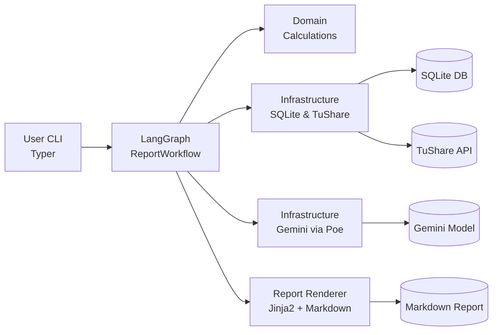

# A-Share Equity Research Report Generator

## Overview
This scaffold delivers a modular CLI workflow that automates generation of deep-dive reports for companies listed on China's A-share market. The design follows a layered architecture so that domain calculations, infrastructure adapters, LangGraph orchestration, and presentation (CLI + Markdown) remain isolated.

Boundary rules: structured行情/财报数据仅经 TuShare；新闻、舆情与推理全部走 Poe（Gemini），可按场景切换 `web_search` 并设定 `thinking_budget`（环境变量或调用时覆盖）。

## High-level Workflow

Current LangGraph stage order (parallel data/info branches + reviewer + charts): `ingest_financials → enrich_market` ║ `news_fetch_mapreduce` → `quant_metrics` + `qual_research` → `valuation` → `narrative_writer` → `risk` → `reviewer` → `chart_builder` → `writing` → `qa`.

## Directory Layout
```text
.
|-- config.py               # Global defaults and environment loading
|-- requirements.txt        # Python dependencies
|-- pyproject.toml          # Optional packaging metadata
|-- src/
|   `-- astock_report/
|       |-- app/            # Entry point wiring Typer CLI
|       |-- cli/            # Typer commands
|       |-- domain/         # Financial models and calculation services
|       |-- infrastructure/ # SQLite, TuShare, Gemini adapters
|       |-- reports/        # Markdown renderer and templates
|       |-- workflows/      # LangGraph graph, nodes, and state definitions
|       `-- utils/          # Logging helpers and shared utilities
|-- tests/                  # pytest smoke tests
`-- docs/architecture.md    # High-level architecture notes
```

## Prerequisites
- Python 3.10+
- (Optional) pandoc if you plan to convert Markdown reports to PDF later on

```bash
python -m venv .venv
.venv\Scripts\activate  # Windows PowerShell
pip install -r requirements.txt
```

## Environment Variables
| Variable | Description | Default |
|----------|-------------|---------|
| APP_DEBUG | Enable verbose logging (0 or 1) | 0 |
| DB_PATH | SQLite database location | ./data/financials.db |
| TUSHARE_API_KEY | TuShare token for financial data pulls | (required) |
| POE_API_KEY | Poe API key used for Gemini access | (optional) |
| PROXY_URL | Optional HTTP/S proxy used by external APIs | (empty) |
| GEMINI_MODEL | Default Gemini model name | gemini-2.5-pro |
| POE_WEB_SEARCH | Force Gemini calls to enable web search (0 or 1) | (empty/off) |
| POE_THINKING_BUDGET | Optional thinking_budget token cap for Poe calls | (empty) |
| OUTPUT_DIR | Where Markdown outputs are stored | ./reports |

You can keep these in a .env file (loaded via python-dotenv) or export them in your shell before running the CLI.

## Quick Start
1. Copy `.env.example` to `.env` and fill in TUSHARE/POE tokens (or export env vars directly).
2. Prepare the SQLite database. If you already have staged financial data, place it at DB_PATH using the schema described in docs/architecture.md. Otherwise, the workflow will fall back to TuShare and cache.
3. Run the CLI:
   ```bash
   python -m astock_report.app.main generate 600000.SH --name "SPD Bank" --pdf --pdf-source html
   # or batch
   python -m astock_report.app.main batch 600000.SH 000001.SZ --pdf
   ```
4. The Markdown report is written to `reports/600000.SH.md` (and HTML at `reports/600000.SH.html`, PDF if pandoc is installed). Add `--json` to also persist the full workflow state payload for debugging. Use `--pdf-source md|html` to choose which artifact Pandoc converts.

## TuShare Resources
- Local API docs, scripts, and offline cache live in `TushareAPI/` (see its README for layout).
- Connection rules (token/URL/proxy) are defined in `TushareAPI/TUSHARE_CONFIG.md` and must be followed for all stock-data calls.
- The TuShare client auto-honors `TUSHARE_BASE_URL` (default `http://api.tushare.pro/dataapi`) and `TUSHARE_PROXY`/`PROXY_URL`; set them in your shell or `.a_stock_env` so new terminals work out of the box.
- Financial interfaces sometimes return duplicate rows because current-quarter (或年度) data get revised. Use `update_flag` to distinguish: `update_flag=1` means revised, `update_flag=0` is the initial release. If you do not see `update_flag` in the payload, request it explicitly via `fields='ts_code,period,update_flag'` (comma-separated).

## Development Notes
- **LangGraph nodes** live under src/astock_report/workflows/nodes/. Wire new nodes inside ReportWorkflow._build_graph.
- **Financial calculations** should be implemented in domain/services/calculations.py so that they remain pure and testable.
- **Data access** calls go through infrastructure/db/sqlite.py and infrastructure/data_providers/.
- **LLM integration** is encapsulated by infrastructure/llm/gemini_client.py. Swap providers here when needed.
- **Report templates** (reports/templates/base_report.md.j2) currently emit Chinese Markdown per the product plan; adjust sections or add themes here.

### Gemini (Poe) Usage
```python
import openai

client = openai.OpenAI(
    api_key="YOUR_POE_API_KEY",
    base_url="https://api.poe.com/v1",
)

chat = client.chat.completions.create(
    model="gemini-2.5-pro",
    messages=[{"role": "user", "content": "Hello world"}],
    extra_body={
        "web_search": True,          # turn on/off web search per call
        "thinking_budget": 4096,     # optional reasoning budget
    },
)

print(chat.choices[0].message.content)
```

## Tests
```bash
PYTHONPATH=src python -m pytest -q
```

## Suggested Next Steps
- Enhance citation checks and reviewer rules for stricter QA.
- Add chart caching/themes and PDF styling.
- Tighten CI (coverage thresholds, ruff/mypy gating).
- Harden narrative JSON parsing so all sections (company/industry/growth/financial/valuation) are always populated; add QA-triggered retry when sections are missing.
